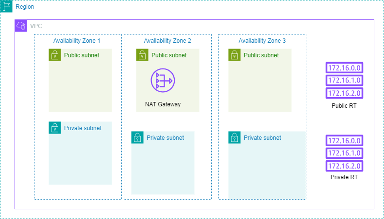

# Day 2: Setting up Terraform

## Participant Details
- **Name:** Kevin Tuei
- **Task Completed:** Deploying Basic Infrastructure with Terraform
- **Date and Time:** 2024-08-19 7:32pm

main.tf
```bash
# Configure the AWS Provider
provider "aws" {
  region = "us-east-1"
}

locals {
  team        = "api_mgmt_dev"
  application = "corp_api"
  server_name = "ec2-${var.environment}-api-${var.variables_sub_az}"
}

#Retrieve the list of AZs in the current AWS region
data "aws_availability_zones" "available" {}
data "aws_region" "current" {}

# Terraform Data Block - Lookup Ubuntu 22.04
data "aws_ami" "ubuntu_22_04" {
  most_recent = true

  filter {
    name   = "name"
    values = ["ubuntu/images/hvm-ssd/ubuntu-jammy-22.04-amd64-server-*"]
  }

  owners = ["099720109477"]
}


#Define the VPC
resource "aws_vpc" "vpc" {
  cidr_block = var.vpc_cidr

  tags = {
    Name        = var.vpc_name
    Environment = "demo_environment"
    Terraform   = "true"
    Region      = data.aws_region.current.name

  }
}


#Deploy the private subnets
resource "aws_subnet" "private_subnets" {
  for_each          = var.private_subnets
  vpc_id            = aws_vpc.vpc.id
  cidr_block        = cidrsubnet(var.vpc_cidr, 8, each.value)
  availability_zone = tolist(data.aws_availability_zones.available.names)[each.value]

  tags = {
    Name      = each.key
    Terraform = "true"
  }
}

#Deploy the public subnets
resource "aws_subnet" "public_subnets" {
  for_each                = var.public_subnets
  vpc_id                  = aws_vpc.vpc.id
  cidr_block              = cidrsubnet(var.vpc_cidr, 8, each.value + 100)
  availability_zone       = tolist(data.aws_availability_zones.available.names)[each.value]
  map_public_ip_on_launch = true

  tags = {
    Name      = each.key
    Terraform = "true"
  }
}

#Create route tables for public and private subnets
resource "aws_route_table" "public_route_table" {
  vpc_id = aws_vpc.vpc.id

  route {
    cidr_block = "0.0.0.0/0"
    gateway_id = aws_internet_gateway.internet_gateway.id
    #nat_gateway_id = aws_nat_gateway.nat_gateway.id
  }
  tags = {
    Name      = "demo_public_rtb"
    Terraform = "true"
  }
}

resource "aws_route_table" "private_route_table" {
  vpc_id = aws_vpc.vpc.id

  route {
    cidr_block = "0.0.0.0/0"
    # gateway_id     = aws_internet_gateway.internet_gateway.id
    nat_gateway_id = aws_nat_gateway.nat_gateway.id
  }
  tags = {
    Name      = "demo_private_rtb"
    Terraform = "true"
  }
}

#Create route table associations
resource "aws_route_table_association" "public" {
  depends_on     = [aws_subnet.public_subnets]
  route_table_id = aws_route_table.public_route_table.id
  for_each       = aws_subnet.public_subnets
  subnet_id      = each.value.id
}

resource "aws_route_table_association" "private" {
  depends_on     = [aws_subnet.private_subnets]
  route_table_id = aws_route_table.private_route_table.id
  for_each       = aws_subnet.private_subnets
  subnet_id      = each.value.id
}

#Create Internet Gateway
resource "aws_internet_gateway" "internet_gateway" {
  vpc_id = aws_vpc.vpc.id
  tags = {
    Name = "demo_igw"
  }
}

#Create EIP for NAT Gateway
resource "aws_eip" "nat_gateway_eip" {
  domain     = "vpc"
  depends_on = [aws_internet_gateway.internet_gateway]
  tags = {
    Name = "demo_igw_eip"
  }
}

#Create NAT Gateway
resource "aws_nat_gateway" "nat_gateway" {
  depends_on    = [aws_subnet.public_subnets]
  allocation_id = aws_eip.nat_gateway_eip.id
  subnet_id     = aws_subnet.public_subnets["public_subnet_1"].id
  tags = {
    Name = "demo_nat_gateway"
  }
}

# Terraform Resource Block - To Build EC2 instance in Public Subnet
resource "aws_instance" "web_server" {
  ami           = data.aws_ami.ubuntu_22_04.id
  instance_type = "t3.micro"
  subnet_id     = aws_subnet.public_subnets["public_subnet_1"].id
  tags = {
    Name  = local.server_name
    Owner = local.team
    App   = local.application
  }
}


resource "aws_subnet" "variables-subnet" {
  vpc_id                  = aws_vpc.vpc.id
  cidr_block              = var.variables_sub_cidr
  availability_zone       = var.variables_sub_az
  map_public_ip_on_launch = var.variables_sub_auto_ip

  tags = {
    Name      = "sub-variables-${var.variables_sub_az}"
    Terraform = "true"
  }
}
```

variables.tf
```bash
variable "aws_region" {
  type    = string
  default = "us-east-1"
}

variable "vpc_name" {
  type    = string
  default = "demo_vpc"
}

variable "vpc_cidr" {
  type    = string
  default = "10.0.0.0/16"
}

variable "private_subnets" {
  default = {
    "private_subnet_1" = 1
    "private_subnet_2" = 2
    "private_subnet_3" = 3
  }
}

variable "public_subnets" {
  default = {
    "public_subnet_1" = 1
    "public_subnet_2" = 2
    "public_subnet_3" = 3
  }
}

variable "variables_sub_cidr" {
  description = "CIDR Block for the Variables Subnet"
  type        = string
  default     = "10.0.202.0/24"
}

variable "variables_sub_az" {
  description = "Availability Zone used Variables Subnet"
  type        = string
  default     = "us-east-1a"
}

variable "variables_sub_auto_ip" {
  description = "Set Automatic IP Assigment for Variables Subnet"
  type        = bool
  default     = true
}

variable "environment" {
  description = "Environment for deployment"
  type        = string
  default     = "dev"
}
```
My first AWS Architecture Diagram featuring 3 Public Subnets, 3 Private Subntes, 3 AZs and a Public and Private Route Table, with a NAT Gateway in the second AZ.

